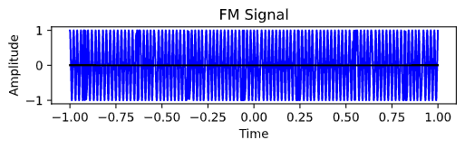

# Principles of Communication Systems

This repository contains PCS Lab assignment solutions

# Data

I have included ECG data in the data folder. I will be using the ECG readings to generate a wave and apply amplitude and frequency modulation.

### Usage

#### AM input

```bash
Enter required modulating index: 0.9
Enter carrier frequency: 50
```

#### FM input

```bash
Enter frequency of carrier: 50
Enter deviation ratio: 0.5
Enter kf value: 10
```

### Message signal


### Amplitude Modulatd wave


### Frequency Modulated wave

